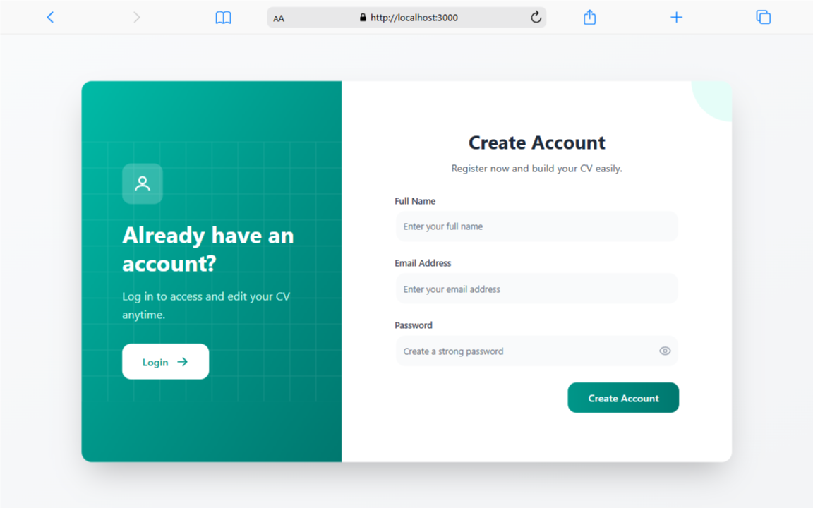
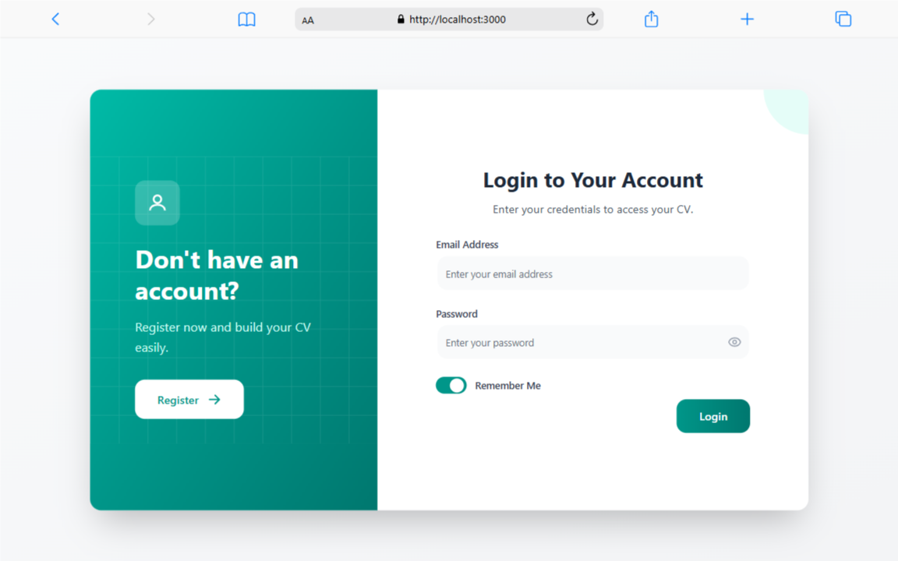
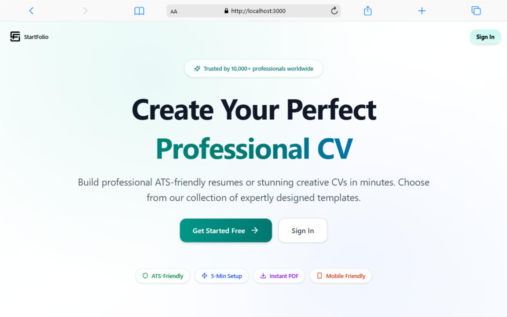
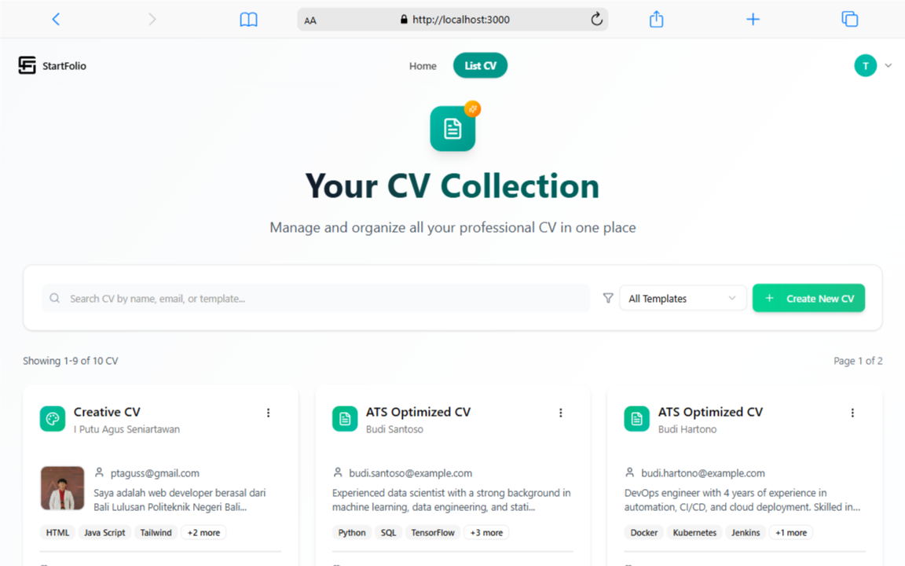
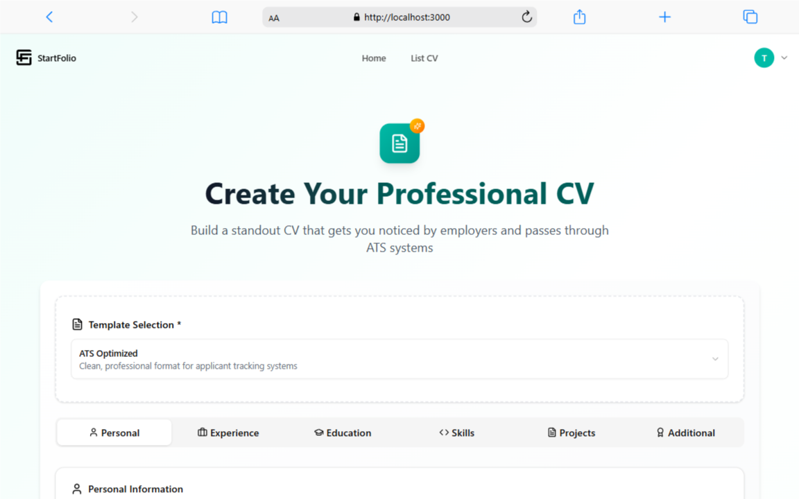
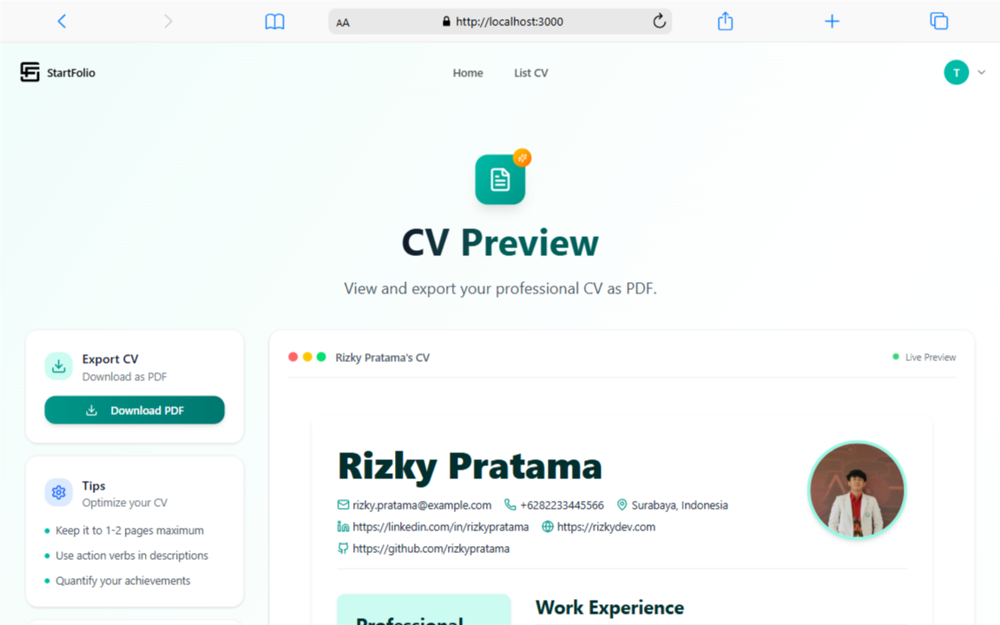
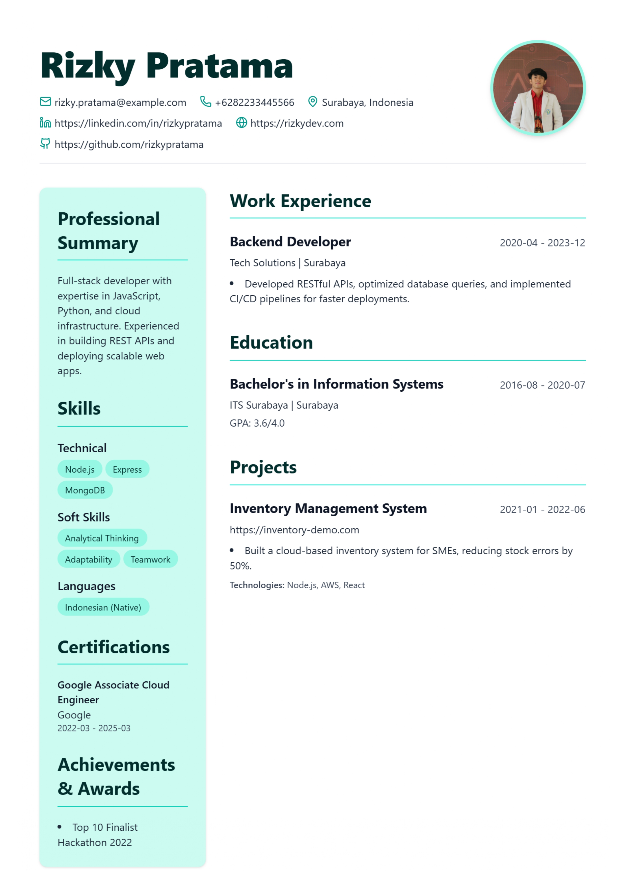

# StartFolio CV Generator

StartFolio adalah platform modern untuk membuat CV profesional dan kreatif dengan mudah, cepat, dan ATS-friendly. Dibangun menggunakan Next.js 15, Prisma, dan TailwindCSS.

## 🚀 Fitur Utama

- **Template ATS-Friendly**: CV yang lolos sistem pelacakan pelamar (ATS).
- **Template Kreatif**: Desain menarik untuk industri kreatif.
- **Live Preview**: Lihat perubahan CV secara real-time.
- **Export PDF Instan**: Download CV siap kirim dalam format PDF.
- **Mobile Friendly**: Desain responsif untuk semua perangkat.
- **Keamanan Data**: Autentikasi JWT dan penyimpanan terenkripsi.

## 📦 Instalasi & Penggunaan

1. **Clone repository:**

   ```bash
   git clone https://github.com/yourusername/startfolio.git
   cd startfolio
   ```

2. **Install dependencies:**

   ```bash
   npm install
   # atau
   yarn install
   ```

3. **Setup database:**

   - Edit `.env` dan sesuaikan `DATABASE_URL`.
   - Jalankan migrasi Prisma:
     ```bash
     npx prisma migrate dev
     ```

4. **Jalankan server development:**

   ```bash
   npm run dev
   # atau
   yarn dev
   ```

5. **Akses aplikasi:**
   Buka [http://localhost:3000](http://localhost:3000) di browser.

## 📸 Contoh Hasil Project

Berikut beberapa contoh hasil halaman dan CV yang dihasilkan oleh StartFolio:

<table>
  <tr>
    <td></td>
    <td></td>
  </tr>
  <tr>
    <td></td>
    <td></td>
  </tr>
  <tr>
    <td></td>
    <td></td>
  </tr>
  <tr>
    <td></td>
    <td></td>
  </tr>
</table>

## 📚 Dokumentasi & Resource

- [Next.js Documentation](https://nextjs.org/docs)
- [Prisma ORM](https://www.prisma.io/docs)
- [TailwindCSS](https://tailwindcss.com/docs)

---

**StartFolio** — Solusi modern untuk CV profesional dan kreatif.
